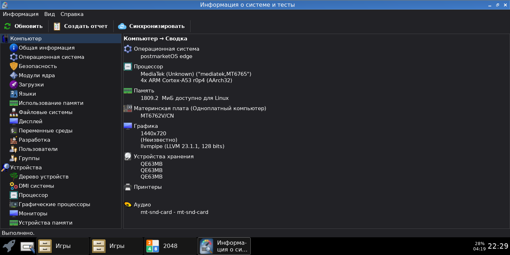
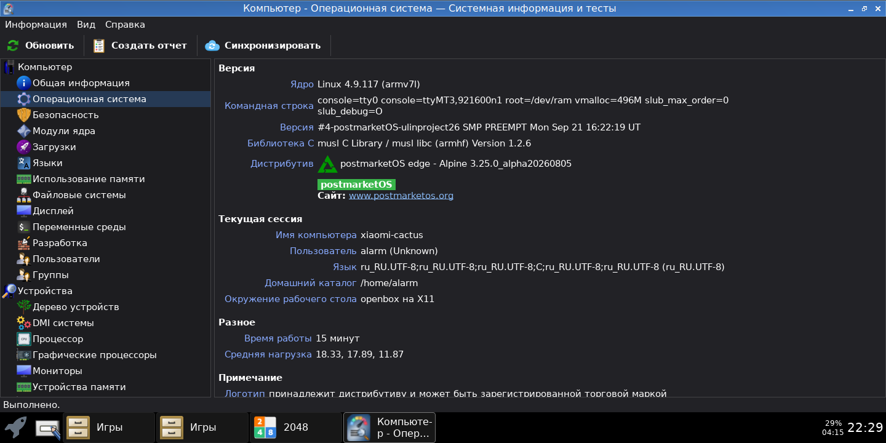
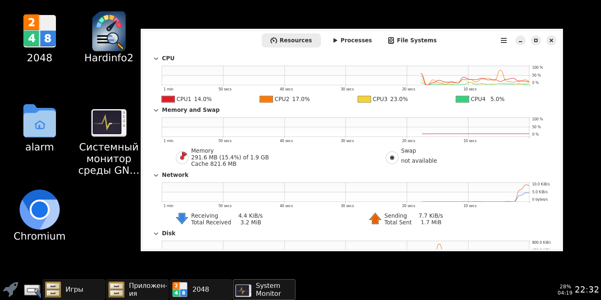

<div id="header" align="center">

  <b>[redmi6a-postmarketos]</b>
  
  (Description and patches for launching postmarketOS..)
  </br></br>
<div id="badges">
  <a href="https://github.com/denisandroid">
    
  </a>
</div>
</div>

## Description
This is a simple weekend project: running the current version of postmarketOS on a long-obsolete smartphone. Don't expect a turn-key solution that can serve as your primary daily driver.

## Disclaimer
| :boom: Please Read Carefully |
|:------------------|
| :warning: **Xiaomi** and **Redmi** are registered trademarks of Xiaomi Inc. The author has no affiliation with Xiaomi and does not provide hardware advice. For official support, please refer to Xiaomi’s website. |
| :warning: **Bootloader unlocking is not covered in this guide.** All instructions provided here assume that your device already has an unlocked bootloader. |
| :warning: Anything you do based on the information provided here is **entirely at your own risk**. The author is not responsible for any damage to your device (bricking, bootloops, hardware failure, etc.). |
| :warning: All information is based on personal research and experimentation; it **may contain errors** or outdated steps. |
| :warning: This material is provided strictly for **informational and educational purposes** only. |

## Specifications

| name | value | status |
| ---- | ----- | ------ |
| board / codename | xiaomi-cactus |  |
| SoC | MediaTek Helio A22 (MT6762M / MT6761) |  |
| kernel | 4.9.117 (armv7, non mainline) | **Working.** The kernel and OS only boot in `armv7` mode. Running `aarch64` is not recommended until mainline kernel support is achieved. |
| cpu | Quad-core 2.0 GHz Cortex-A53 (12nm) | **Working.** Governors: `schedplus`, `powersave`, `conservative`, and `ondemand`. *Note: `schedutil` performs poorly.* |
| gpu | PowerVR Rogue GE8320 | **WIP.** GPU firmware can be loaded, but nothing beyond that. No active attempts to enable full hardware acceleration yet; waiting for mainline kernel support. |
| mem | 2 GB LPDDR3 | **Working** out of the box. |
| storage | 16 GB / 32 GB eMMC | **Working.** Both internal eMMC and external MicroSD cards are fully functional. |
| display | 5.45" IPS LCD 1440×720 | **Working.** Backlight brightness control patch applied; works flawlessly. |
| touchscreen | FocalTech (fts_ts) | **Working** out of the box. |
| sound | Mono speaker, 3.5mm jack | **Unstable.** Unclear behavior; certain modes may trigger a kernel panic. It is highly recommended to disable or avoid using audio for now. |
| usb | Micro-USB 2.0 (with OTG support) | **Working.** Only OTG and legacy RNDIS (USB networking) have been tested and verified. |
| connectivity | Wi-Fi, Bluetooth, GPS | **Untested.** No attempts have been made to initialize or test wireless modules yet. |
| sensors | Accelerometer, Light & Proximity | **Untested.** Not worked on or initialized. |
| camera | Front & Rear | **Untested.** Not worked on or initialized. |
| battery | BN37 (Max 4.4V) | **Partial.** A primitive linear capacity calculation patch is applied (not suitable for daily driver use). If you prefer to use the proprietary MTK downstream kernel blob, do not apply this patch. |
| leds | Front notification LED, Flashlight | **Working.** Both LEDs are fully operational. (/sys/class/leds/flashlight/brightness - flashlight; /sys/class/leds/blue/brightness - LED on the screen)|
| vibration | — | **Working.** However, no custom patches were made to integrate it into standard Linux subsystem frameworks. To trigger vibration, you must manually set the duration (/sys/class/leds/vibrator/duration) first and then write `1` to `activate`. (/sys/class/leds/vibrator) |
| buttons | Volume Up, Volume Down, Power | **Working.** Key patch added. |

## Software

Running a modern Linux software stack on this hardware has its nuances:
* **Init System:** Only `OpenRC` is currently supported and working. `systemd` is completely non-functional at this stage.
* **Toolkits:** 
  * `Qt` applications run fully and stably out of the box, with excellent touchscreen responsiveness.
  * `GTK` applications fail to launch cleanly due to an outdated kernel and a broken `bwrap` (bubblewrap) sandbox mechanism (fixed via temporary patches). Even with custom patches applied, touchscreen behavior remains problematic. For example, in `Xfce`, tapping the main application menu does not trigger an action no matter how many times you click it, whereas panel widgets like the clock/date menu respond perfectly.
* **Browsers:** Both `Chromium` and `Firefox` run stably.
* **Display Server & Window Managers:** `X11` works flawlessly, and `Openbox` is highly recommended as a lightweight starting point. No attempts have been made to run `Wayland` environments.
* **Performance:** Overall system responsiveness and performance are exactly what you would expect from a low-end SoC of this generation (without a GPU).

## Screenshots

</img>
</img>
</img>

[See all](./screenshots)


## Patches

A collection of workarounds and fixes to resolve various issues. Keep in mind that most major problems and limitations stem directly from the outdated kernel.

<details> 
  <summary><b># Display Manager Fails to Launch / Screen Frozen on Boot (tinydm)</b></summary>

  On a fresh postmarketOS installation with a lightweight environment like `Openbox`, `X11` might frozen on boot, leaving the display completely frozen. However, running `killall Xorg && /etc/init.d/tinydm restart` manually via SSH brings up the graphical interface perfectly. Adding a 3-second delay to the `tinydm` init script ensures a successful boot every time.

  > ⚠️ **Note:** This is not a proper solution. Be aware that system updates may overwrite this file and restore the original `tinydm` binary.

  ### Step 1: Add a delay to the tinydm init script
  Edit the configuration file to include a `sleep 3` command inside the `start_pre()` block:

  **File:** `/etc/init.d/tinydm`
  
  ```sh
  #!/sbin/openrc-run
# Copyright 2020 Oliver Smith
# SPDX-License-Identifier: GPL-3.0-or-later
supervisor=supervise-daemon

name="tinydm"
description="tinydm"

command="/usr/bin/autologin"
command_args="tinydm-run-session"

depend() {
        provide display-manager
        need localmount
        want dbus elogind
}

start_pre() {
        sleep 3

        # default to 1000 if none set in config
        [ -z "$AUTOLOGIN_UID" ] && AUTOLOGIN_UID=1000

        user=$(getent passwd ${AUTOLOGIN_UID} | cut -d: -f1)
        if [ -z "$user" ]; then
                eerror "ERROR: unable to find user with uid $AUTOLOGIN_UID"
                return 1
        fi

        command_args="$user $command_args"
}
  ```

  ### Step 2: Restart the service
  Apply the patch immediately by restarting the display manager service:
  ```bash
  sudo rc-service tinydm restart
  ```
</details>

<details> 
  <summary><b># Time & Date (chronyd)</b></summary>
  
  **File:** `/etc/conf.d/chronyd`
  
  ```ini
  command_args="-F 0"
  ```

  Without this configuration change, the `chronyd` time synchronization daemon won't even start on this device. 
</details>

<details> 
  <summary><b># GTK & Icons Fix (gtk, bwrap)</b></summary>

  Because sandbox isolation via `bwrap` fails completely on this outdated kernel, launching most modern GTK applications is normally impossible. This patch acts as a workaround by substituting `bwrap` with a wrapper script to bypass isolation entirely. 
  
  > ⚠️ **Note:** This is not a proper solution. Be aware that system updates may overwrite this file and restore the original `bwrap` binary.

  Invalid logs:
  ```
  [Sep 23 22:56:09] kern kernel: .(1)[3386:bwrap][3386:bwrap] fork [3400:bwrap] total fork time[1147761310 ns] > 1s
[Sep 23 22:56:09] kern kernel: .(1)[3386:bwrap]Mem-Info:
[Sep 23 22:56:09] kern kernel: .(1)[3386:bwrap]active_anon:28059 inactive_anon:2296 isolated_anon:0\x0a active_file:18724 inactive_file:36499 isolated_file:0\x0a unevictable:0 dirty:20 writeback:0 unstable:0\x0a slab_reclaimable:3894 slab_unreclaimable:5662\x0a mapped:32740 shmem:2581 pagetables:695 bounce:0\x0a free:357590 free_pcp:1167 free_cma:0
[Sep 23 22:56:09] kern kernel: .(1)[3386:bwrap]Node 0 active_anon:112236kB inactive_anon:9184kB active_file:74896kB inactive_file:145996kB unevictable:0kB isolated(anon):0kB isolated(file):0kB mapped:130960kB dirty:80kB writeback:0kB shmem:10324kB writeback_tmp:0kB unstable:0kB pages_scanned:0 all_unreclaimable? no
[Sep 23 22:56:09] kern kernel: Normal free:408696kB min:2764kB low:3452kB high:4140kB active_anon:0kB inactive_anon:0kB active_file:16168kB inactive_file:1316kB unevictable:0kB writepending:40kB present:532160kB managed:486960kB mlocked:0kB slab_reclaimable:15576kB slab_unreclaimable:22648kB kernel_stack:2816kB pagetables:2780kB bounce:0kB free_pcp:2076kB local_pcp:356kB free_cma:0kB
[Sep 23 22:56:09] kern kernel: .(1)[3386:bwrap]lowmem_reserve[]: 0 9231 9231
[Sep 23 22:56:09] kern kernel: HighMem free:1021664kB min:512kB low:2220kB high:3928kB active_anon:112236kB inactive_anon:9184kB active_file:58728kB inactive_file:144680kB unevictable:0kB writepending:40kB present:1445624kB managed:1367736kB mlocked:0kB slab_reclaimable:0kB slab_unreclaimable:0kB kernel_stack:0kB pagetables:0kB bounce:0kB free_pcp:2592kB local_pcp:620kB free_cma:0kB
[Sep 23 22:56:09] kern kernel: .(1)[3386:bwrap]lowmem_reserve[]: 0 0 0
[Sep 23 22:56:09] kern kernel: Normal: 60*4kB (UME) 29*8kB (UME) 10*16kB (UME) 4*32kB (ME) 8*64kB (UM) 5*128kB (M) 5*256kB (M) 6*512kB (UME) 5*1024kB (M) 4*2048kB (UM) 95*4096kB (M) = 408696kB
[Sep 23 22:56:09] kern kernel: HighMem: 16*4kB (UM) 16*8kB (UM) 14*16kB (UM) 8*32kB (UM) 5*64kB (M) 6*128kB (UM) 4*256kB (UM) 4*512kB (U) 3*1024kB (UM) 5*2048kB (UM) 245*4096kB (UM) = 1021664kB
[Sep 23 22:56:09] kern kernel: .(1)[3386:bwrap]57803 total pagecache pages
[Sep 23 22:56:09] kern kernel: .(1)[3386:bwrap]0 pages in swap cache
[Sep 23 22:56:09] kern kernel: .(1)[3386:bwrap]Swap cache stats: add 0, delete 0, find 0/0
[Sep 23 22:56:09] kern kernel: .(1)[3386:bwrap]Free swap  = 0kB
[Sep 23 22:56:09] kern kernel: .(1)[3386:bwrap]Total swap = 0kB
  ```
  
  ### Step 1: Remove or backup the original binary
  ```bash
  sudo rm -f /bin/bwrap
  sudo rm -f /usr/bin/bwrap
  ```
  ### Step 2: Create the wrapper script
  **File:** `/usr/bin/bwrap`
  
  ```sh
#!/bin/sh

export container=bwrap
export UNDER_BWRAP=1

DBUS_FD=$(echo "$@" | grep -o -- '--dbus-fd [0-9]*' | awk '{print $2}')

if echo "$@" | grep -q "glycin"; then
    if echo "$@" | grep -q "glycin-svg"; then
        exec "/usr/libexec/glycin-loaders/2+/glycin-svg" --dbus-fd "$DBUS_FD"
    fi

    if echo "$@" | grep -q "glycin-image-rs"; then
        exec "/usr/libexec/glycin-loaders/2+/glycin-image-rs" --dbus-fd "$DBUS_FD"
    fi
fi

exit 0
  ```

  ```bash
  chmod +x /usr/bin/bwrap
  ```
</details>


<details> 
  <summary><b># RNDIS Disconnects & Slow SSH Login (otg, rndis)</b></summary>

  This issue is caused by `NetworkManager`, which is not fully debugged for this device. Disconnecting and reconnecting the USB cable breaks the RNDIS connection, and SSH logins experience significant delays. To resolve this, you can configure NetworkManager to ignore the `rndis0` interface and let `unudhcpd` handle it instead.
  
  ### Step 1: Make rndis0 unmanaged in NetworkManager
  **File:** `/etc/NetworkManager/conf.d/99-unmanaged-devices.conf`
  ```ini
  [keyfile]
  unmanaged-devices=interface-name:rndis0
  ```

  ### Step 2: Symlink and enable the unudhcpd service
  Run the following commands to create a dedicated service instance for `rndis0` and add it to the default runlevel:
  ```bash
  sudo ln -s /etc/init.d/unudhcpd /etc/init.d/unudhcpd.rndis0
  sudo rc-update add unudhcpd.rndis0 default
  sudo rc-service unudhcpd.rndis0 start
  ```
</details>


<details> 
  <summary><b># Enable zRAM Swap</b></summary>
  The kernel retains the ability to use zram, but only for a single device and without `modprobe` support. The standard postmarket zram service does not work with it.

  ### Step 1: Create the custom init script
  **File**: `/etc/init.d/custom-zram`
  ```bash
  #!/sbin/openrc-run

description="Custom zRAM setup for 1.8GB device"

depend() {
    after modules
    before localmount
}

start() {
    ebegin "Starting custom zRAM swap"

    modprobe zram num_devices=1 2>/dev/null || true

    swapoff /dev/zram0 2>/dev/null || true
    echo 1 > /sys/block/zram0/reset
    echo lz4 > /sys/block/zram0/comp_algorithm
    echo 2147483648 > /sys/block/zram0/disksize

    mkswap /dev/zram0 >/dev/null
    swapon -p 100 /dev/zram0

    sysctl -w vm.swappiness=100 >/dev/null
    sysctl -w vm.watermark_boost_factor=0 >/dev/null

    eend $?
}

stop() {
    ebegin "Stopping custom zRAM swap"
    swapoff /dev/zram0 2>/dev/null || true
    echo 1 > /sys/block/zram0/reset
    eend $?
}
  ```

  ### Step 2: Make the script executable and enable the service
  ```bash
  sudo chmod +x /etc/init.d/custom-zram
  sudo rc-update add custom-zram default
  sudo rc-service custom-zram start
  ```
</details>

<details> 
  <summary><b># Share PC Internet Access via RNDIS (otg, rndis)</b></summary>

  While this is not unique to this specific device, here is how to route internet traffic from your host PC to the smartphone over the USB RNDIS interface.

  ### Step 1: On the Smartphone (postmarketOS)
  Instead of running the `ip route` command manually every time you connect the cable, you can create a `udev` rule to automate this process.

  **File:** `/etc/udev/rules.d/99-rndis-route.rules`
  ```ini
  ACTION=="add", SUBSYSTEM=="net", KERNEL=="rndis0", RUN+="/sbin/ip route add default via 172.16.42.2 dev rndis0 table main"
  ```

  *Alternative (one-time manual command):*
  ```bash
  sudo ip route add default via 172.16.42.2 dev rndis0 table main
  ```

  ### Step 2: On the Host PC (Linux)
  Enable packet forwarding and configure NAT (`iptables`) to share your internet connection. 
  
  *Note: Replace `<your_pc_internet_interface>` (e.g., `eth0`, `wlan0`) and `<your_phone_usb_interface>` (e.g., `enp3s0f4u1...`) with your actual network interface names from `ip a`.*

  ```bash
  # 1. Enable IPv4 packet forwarding in the Linux kernel
  sudo sysctl net.ipv4.ip_forward=1

  # 2. Enable Masquerading (NAT) on your main internet-facing interface
  sudo iptables -t nat -A POSTROUTING -o <your_pc_internet_interface> -j MASQUERADE

  # 3. Allow traffic forwarding between the internet and the phone interfaces
  sudo iptables -A FORWARD -i <your_phone_usb_interface> -o <your_pc_internet_interface> -j ACCEPT
  sudo iptables -A FORWARD -i <your_pc_internet_interface> -o <your_phone_usb_interface> -m state --state RELATED,ESTABLISHED -j ACCEPT
  ```
</details>


<details> 
  <summary><b># Display Backlight Control (udev)</b></summary>

  Patches for fully functional backlight control are already included in the kernel. To control brightness without root privileges, you just need to ensure the `video` group exists, assign your user to it, and deploy the appropriate `udev` rule.

  ### Step 1: Create the video group and add your user
  Run the following commands to create the group (in case it does not exist) and add your current user to it:
  ```bash
  sudo groupadd -f video
  sudo adduser $USER video
  ```

  ### Step 2: Create the udev rule
  **File:** `/etc/udev/rules.d/99-backlight.rules`
  
  ```ini
  SUBSYSTEM=="backlight", ACTION=="add", KERNEL=="backlight", PROGRAM="/bin/chgrp video /sys/class/backlight/%k/brightness /sys/class/backlight/%k/bl_power", RUN+="/bin/chmod g+w /sys/class/backlight/%k/brightness /sys/class/backlight/%k/bl_power"
  ```

  ### Step 3: Apply changes
  ```bash
  sudo udevadm control --reload-rules && sudo udevadm trigger
  ```
</details>

<details> 
  <summary><b># Glycin / Image Loading Fix (gtk, GTK4 & GNOME apps)</b></summary>

  `Glycin` is an image decoding library used by modern GTK4/GNOME applications. Due to its heavy reliance on strict sandboxing features that are broken on outdated kernels, image and icon rendering will fail completely. This patch forces Glycin to bypass sandboxing and corrects resource directory paths.

  ### Step 1: Create a symlink for shared data
  ```bash
  sudo ln -s /usr/share /usr/share/glycin
  ```

  ### Step 2: Override Glycin environment variables
  Create a global environment script to unset broken configurations, disable the sandbox, and remap the data directory:

  **File:** `/etc/profile.d/99ignore-glycin.sh`
  
  ```sh
  #!/bin/sh
  unset GLYCIN_DATA_DIR
  unset GLYCIN_LOADERS_DIR

  export GLYCIN_DATA_DIR="/usr/share"
  export GLYCIN_DISABLE_SANDBOX=1
  ```
</details>


<details> 
  <summary><b># Hide Mouse Cursor (openbox)</b></summary>

  Since this is a touchscreen device, keeping a permanent mouse pointer on the screen is annoying. You can use `unclutter-xfixes` to automatically hide the cursor on touch input or after a brief period of inactivity.

  ### Step 1: Install the utility
  Make sure the required package is installed in your system:
  ```bash
  sudo apk add unclutter-xfixes
  ```

  ### Step 2: Configure Openbox autostart
  Add the following command to hide the cursor automatically on startup and touch interactions:

  **File:** `/home/alarm/.config/openbox/autostart`
  
  ```sh
  unclutter-xfixes --timeout 1 --jitter 5 --hide-on-touch --start-hidden &
  ```
</details>

<details> 
  <summary><b># Screen Not Refreshing / Frozen Display Fix (x11)</b></summary>

  Because this port currently relies on a pre-initialized simple framebuffer without proper hardware GPU acceleration, the display does not refresh its frames automatically. To solve this, you need to configure the `msm-fb-refresher` daemon to force screen updates periodically.
  
  ### Step 1: Create the OpenRC init script
  **File:** `/etc/init.d/msm-fb-refresher`
  
  ```sh
  #!/sbin/openrc-run

  command="/usr/sbin/msm-fb-refresher"
  command_args="--loop -r 60"
  supervisor="supervise-daemon"

  depend() {
          after bootmisc
  }
  ```

  ### Step 2: Make the script executable and enable the service
  Run the following commands to set the correct permissions, register the daemon, and start the display refresher loop immediately:
  ```bash
  sudo chmod +x /etc/init.d/msm-fb-refresher
  sudo rc-update add msm-fb-refresher default
  sudo rc-service msm-fb-refresher start
  ```
</details>


<details> 
  <summary><b># Force Software Rendering (qt, gtk, webkit, ...)</b></summary>
  
  Since full hardware GPU acceleration is not available, forcing software rendering via the CPU is mandatory to ensure UI stability. This patch configures environment variables globally to drop hardware GL calls, bypass sandbox restrictions that cause crashes, and tweak Mesa/Gallium for stable frame pacing.

  ### Step 1: Force Software Rendering (Qt, GTK, and WebKit)
  **File:** `/etc/profile.d/software-rendering.sh`
  ```bash
  #!/bin/sh

export GALLIUM_DRIVER=llvmpipe
export LIBGL_ALWAYS_SOFTWARE=1

export GSK_RENDERER=cairo
export GDK_DEBUG=gl-disable

export QT_XCB_GL_INTEGRATION=none
export QT_QUICK_BACKEND=software

export GTK_DISABLE_SANDBOX=1
export WEB_KIT_DISABLE_SANDBOX=1

export GTK_DISABLE_THUMBNAILS=1

export NO_AT_BRIDGE=1
export GTK_A11Y=none

export GLYCIN_DATA_DIR=/usr/share/glycin
export GDK_PIXBUF_DISABLE_SANDBOX=1
export GTK_DISABLE_SANDBOX=1

export FOZ_DISABLE_SANDBOX=1
export GDK_PIXBUF_MODULE_FILE=/usr/lib/gdk-pixbuf-2.0/2.10.0/loaders.cache

[ -f /lib/gdk-pixbuf-2.0/2.10.0/loaders.cache ] && export GDK_PIXBUF_MODULE_FILE=/lib/gdk-pixbuf-2.0/2.10.0/loaders.cache

export G_DEBUG=0
export G_OBJECT_DEBUG=0
export G_ENABLE_DIAGNOSTIC=0

export GTK_DEBUG=no-warnings
export G_BOOTSTRAP_FACCESSAT=0
export GLYCIN_LOADERS_DIR=/usr/libexec/glycin-loaders


export QT_XCB_GL_INTEGRATION=xcb_egl
export QT_QUICK_BACKEND=software
export LIBGL_ALWAYS_SOFTWARE=1
  ```
</details>

<details> 
  <summary><b># Mute FocalTech Touchscreen ESD</b></summary>

  The FocalTech touchscreen driver continuously floods the kernel log (`dmesg`) with ESD (Electrostatic Discharge) protection routines. While proper integration requires additional Linux userspace tools, the verbose output simply litters logs on this port. This `udev` rule disables the ESD protection mode at the driver level to keep your logs clean.
  
  ### Step 1: Create the udev rule
  **File:** `/etc/udev/rules.d/99-fts-esd.rules`

  ```ini
  ACTION=="add", SUBSYSTEM=="i2c", ATTR{fts_esd_mode}=="*", ATTR{fts_esd_mode}="0"
  ```

  ### Step 2: Apply changes
  Reload the `udev` rules to apply the configuration instantly without rebooting:
  ```bash
  sudo udevadm control --reload-rules && sudo udevadm trigger
  ```
</details>


<details> 
  <summary><b># Display & Touchscreen Rotation (x11, openbox)</b></summary>

  By default, the display initializes in portrait orientation. This patch configures `Xorg` to rotate the frame buffer clockwise (`CW`) and updates the `xinput` coordinate transformation matrix in `Openbox` so that touch inputs align correctly with the rotated screen.

  ### Step 1: Configure Xorg display rotation
  **File:** `/etc/X11/xorg.conf.d/15-fbdev.conf`

  ```ini
  Section "Monitor"
      Identifier "CactusMonitor"
      HorizSync   30.0 - 70.0
      VertRefresh 59.0 - 61.0
      Option      "PreferredMode" "720x1440"
  EndSection

  Section "Device"
      Identifier "CactusVideoCard"
      Driver     "fbdev"
      Option     "ShadowFB" "true"
      Option     "Rotate" "CW"
  EndSection

  Section "Screen"
      Identifier "Default Screen"
      Device     "CactusVideoCard"
      Monitor    "CactusMonitor"
      DefaultDepth 24
      SubSection "Display"
          Depth   24
          Modes   "720x1440"
  EndSubSection
  EndSection
  ```

  ### Step 2: Map touchscreen coordinates in Openbox
  Add this line to ensure the input coordinates match the layout rotation upon session startup. 
  
  *Note: Double-check your touchscreen device ID (replace `8` if your device has a different ID in `xinput list`).*

  **File:** `/home/alarm/.config/openbox/autostart`
  
  ```sh
  xinput set-prop 8 "Coordinate Transformation Matrix" 0 1 0 -1 0 1 0 0 1 &
  ```
</details>

<details> 
  <summary><b># Automatic Reboots (xfce)</b></summary>

  Further testing on `Xfce` was abandoned due to the previously mentioned touchscreen controls. If you encounter unexpected automatic reboots after a specific period of uptime. You can fix this by replacing the `elogind` daemon with a sleeping stub.

  > ⚠️ **Note:** This is not a proper solution. Be aware that system updates may overwrite this file and restore the original `elogind` binary.

  
  ### Step 1: Backup and replace the elogind binary
  Run the following commands to backup the original daemon, create a non-functional shell stub that keeps the init system happy, and make it executable:

  ```bash
  sudo mv /usr/libexec/elogind/elogind /usr/libexec/elogind/elogind.bak

  sudo tee /usr/libexec/elogind/elogind << 'EOF'
  #!/bin/sh
  echo "elogind daemon is completely disabled by stub"
  exec sleep infinity
  EOF
  
  sudo chmod +x /usr/libexec/elogind/elogind
  ```
</details>

## Benchmarks

<details> 
  <summary><b># CPU (4 threads)</b></summary>
  
  ```
  sysbench --threads=4 cpu run
sysbench 1.0.20 (using system LuaJIT 2.1.1723681758)

Running the test with following options:
Number of threads: 4
Initializing random number generator from current time


Prime numbers limit: 10000

Initializing worker threads...

Threads started!

CPU speed:
    events per second:   316.20

General statistics:
    total time:                          10.0080s
    total number of events:              3166

Latency (ms):
         min:                                   12.47
         avg:                                   12.64
         max:                                   35.58
         95th percentile:                       12.75
         sum:                                40012.65

Threads fairness:
    events (avg/stddev):           791.5000/5.41
    execution time (avg/stddev):   10.0032/0.00

  ```
  These are standard figures for an Armv7 2.0 GHz quad-core processor.
</details>
<details> 
  <summary><b># MEMORY (4 threads)</b></summary>
  
  ```
sysbench --threads=4 memory run
sysbench 1.0.20 (using system LuaJIT 2.1.1723681758)

Running the test with following options:
Number of threads: 4
Initializing random number generator from current time


Running memory speed test with the following options:
  block size: 1KiB
  total size: 102400MiB
  operation: write
  scope: global

Initializing worker threads...

Threads started!

Total operations: 18852965 (1884178.24 per second)

18411.10 MiB transferred (1840.02 MiB/sec)


General statistics:
    total time:                          10.0010s
    total number of events:              18852965

Latency (ms):
         min:                                    0.00
         avg:                                    0.00
         max:                                   20.06
         95th percentile:                        0.00
         sum:                                21599.12

Threads fairness:
    events (avg/stddev):           4713241.2500/23170.12
    execution time (avg/stddev):   5.3998/0.00

  ```
</details>


## License
This project is licensed under the **GNU General Public License v2.0** - see the [LICENSE](LICENSE) file for details.
